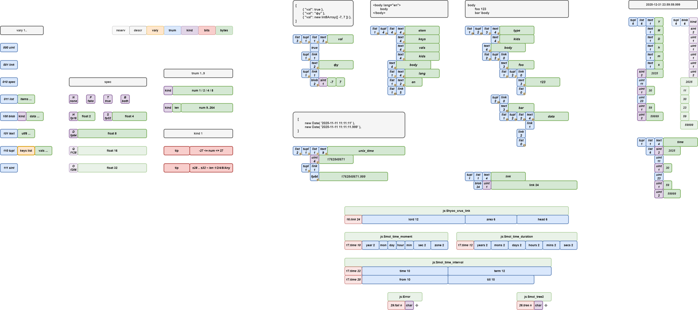
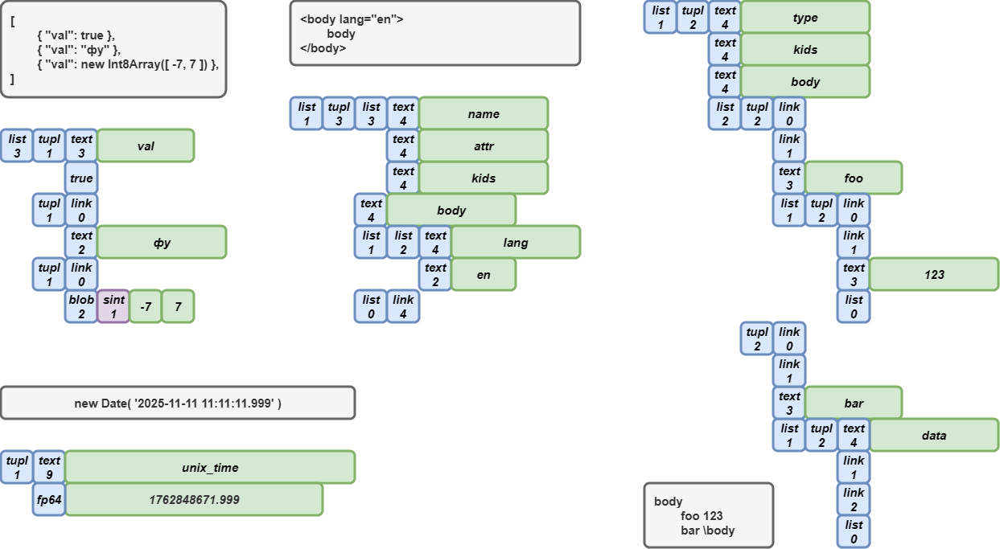

# $mol_vary

> Reference implementation of VaryPack - simple fast compact data binarization format.

## Key Features

- **Deduplication by reference**: same structures are stored as links to first entry. AKA "structured clone".
- **Intergated schema**: schema always stored with data. AKA "schema less".
- **Structural typing**: data mapped to classes by schema. Unique feature!
- **Decentralized extensibility**: custom types support without central registry. Unique feature!
- **Single-pass**: used auto-growable internal buffer.
- **Easy debug**: tiny ints are packed as is, special types are packed as char.

## Comparison

- VaryPack: [$mol_vary](https://github.com/hyoo-ru/mam_mol/tree/master/vary) - reference implementation.
- CBOR: [cbor-x](https://github.com/kriszyp/cbor-x) - fastest implementation with all required extensions (which are standardized, although its don't have wide support).
- MsgPack: [msgpackr](https://github.com/kriszyp/msgpackr) - fastest implementaion with all required extensions (which incompatible with other libs).

|                | $mol_vary | cbor-x      | msgpackr
|----------------|-----------|-------------|---------
| Language       | ✅ TS     | ✅ TS      | ❌ JS
| Performance    | 🆗 100%   | 🆗 100%    | 🆗 100%
| Packed Size    | 🆗 100%   | ❌ +33%    | ❌ +25%
| Lib Size       | ✅ 3KB    | ❌ 11 KB   | ❌ 11 KB
| Compatibility  | ✅ std    | ⭕ ext-std | ❌ ext

[Benchmark](https://perf.js.hyoo.ru/#!bench=j1peaq_k376h9) results:

### Chrome 142


## API

### Usage from NPM

Install [mol_vary](https://www.npmjs.com/package/mol_vary):

```sh
npm install mol_vary
```

Add import: 

```ts
import { $mol_vary } from 'mol_vary'
```

### Binarization

```ts
const buffer = $mol_vary.pack( data )
```

### Pasing

```ts
const data = $mol_vary.take( buffer )
```

### Register custom types

```ts
class Foo {
	
	constructor(
		readonly a: number,
		readonly b: number,
	) {}
	
}

$mol_vary.type(
	[ 'a', 'b' ], // keys as schema
	( a = 0, b = 0 )=> new Foo( a, b ), // factory
	foo => [ foo.a, foo.b ], // vals extractor
)
```

## Internals

### Binary Layout



### Examples


